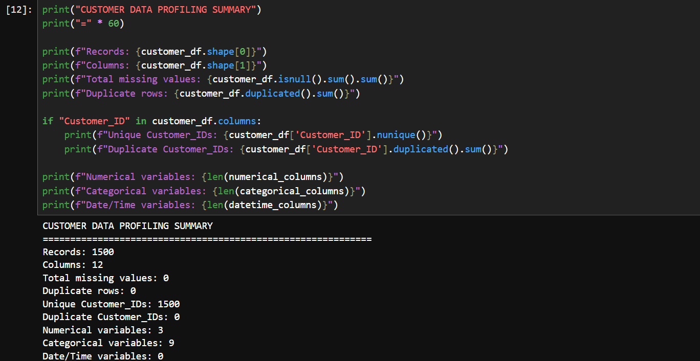
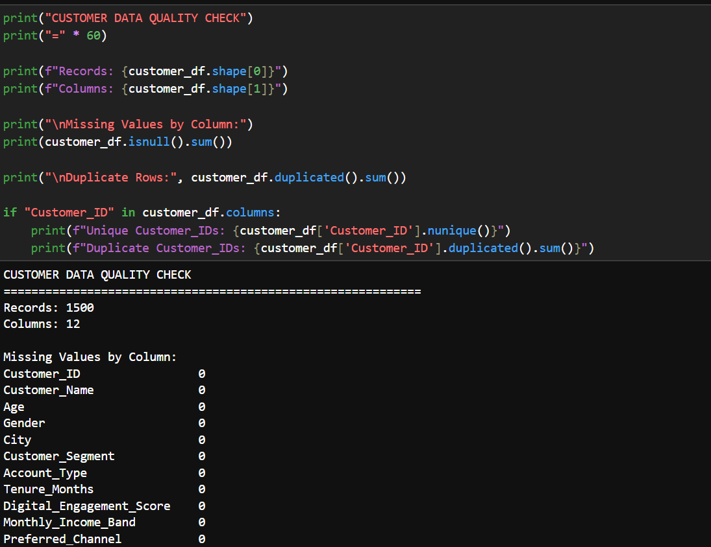
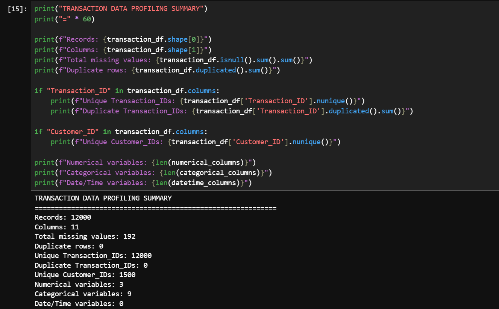
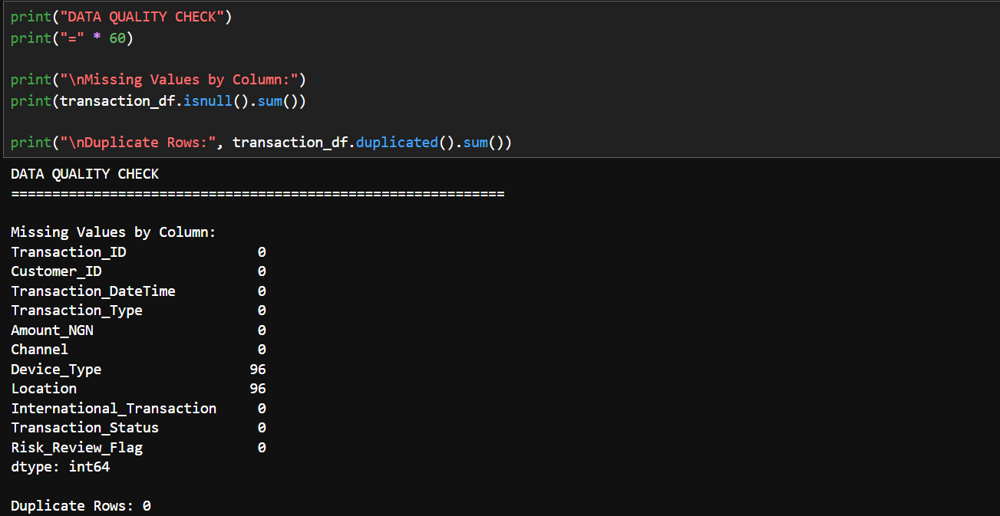
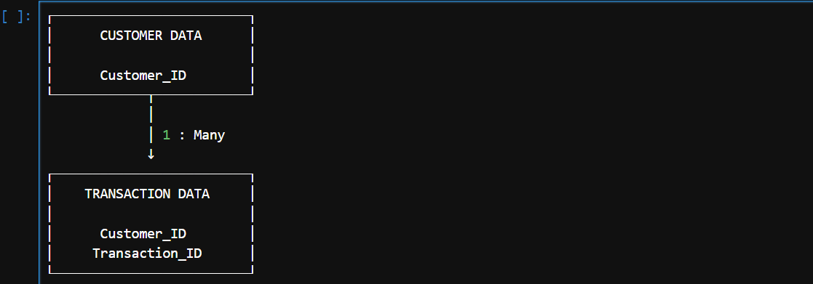

# FinTrust Week 1 — Evidence

This folder contains supporting evidence for the Week 1 Business & Data Intelligence Assessment for the FinTrust Financial Intelligence & Digital Banking Support Solution.

## 1. Customer Data Profiling

This evidence shows the initial profiling and exploration of the customer dataset.

---

## 2. Customer Data Quality Check

This evidence shows the quality assessment performed on the customer dataset, including checks for missing values and duplicate records.

---

## 3. Transaction Data Profiling

This evidence shows the initial profiling and exploration of the transaction dataset.

---

## 4. Transaction Data Quality Check

This evidence shows the quality assessment performed on the transaction dataset, including checks for missing values and duplicate records.

---

## 5. Customer–Transaction Relationship

This evidence shows the planned relationship between the customer and transaction datasets using `Customer_ID`.

---

## Purpose

These files provide visual evidence of the data profiling, data-quality assessment, customer–transaction relationship planning, and dashboard planning activities completed during Week 1.

## Week 1 Status

**Completed**
